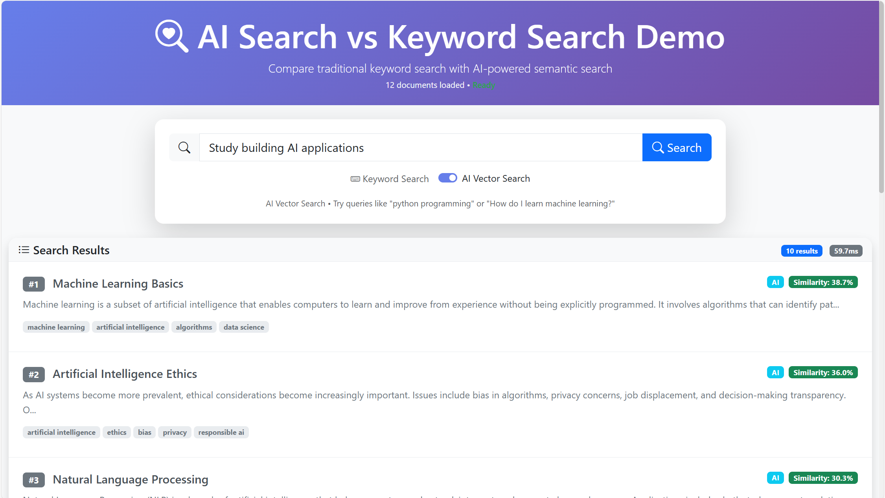

# AI Search vs Keyword Search Demo

A demonstration application showcasing the benefits of AI-powered vector search over traditional keyword search methods.



## Features

- **Dual Search Modes**: Toggle between keyword search (BM-25) and vector search (sentence embeddings)
- **Modern UI**: Clean, responsive interface with real-time search results
- **Sample Dataset**: Pre-loaded documents for immediate testing
- **Performance Comparison**: Visual demonstration of search quality differences

## Technology Stack

- **Backend**: FastAPI (Python)
- **Keyword Search**: BM-25 algorithm (rank-bm25)
- **Vector Search**: Sentence Transformers (transformers + torch)
- **Frontend**: HTML/CSS/JavaScript with Bootstrap
- **Data**: JSON-based document storage

## Setup Instructions

1. **Clone or navigate to the project directory**
   ```bash
   cd ai-search-demo
   ```

2. **Create a virtual environment**
   ```bash
   python -m venv venv
   ```

3. **Activate the virtual environment**
   - Windows: `venv\Scripts\activate`
   - macOS/Linux: `source venv/bin/activate`

4. **Install dependencies**
   ```bash
   pip install -r requirements.txt
   ```

5. **Run the application**
   ```bash
   python run.py
   ```

6. **Open your browser**
   Navigate to `http://localhost:8000`

## Usage

1. **Enter a search query** in the search bar
2. **Toggle between search modes** using the switch
3. **Compare results** between keyword and vector search
4. **Experiment with different query types**:
   - Keywords: "python programming"
   - Natural language: "How do I write a function in Python?"
   - Synonyms: "machine learning" vs "artificial intelligence"

## Search Modes

### Keyword Search (BM-25)
- Uses traditional keyword matching
- Requires exact or partial term matches
- Fast and lightweight
- Limited to specific terms

### Vector Search (Sentence Transformers)
- Uses semantic embeddings
- Understands context and meaning
- Handles synonyms and related concepts
- Better for natural language queries

## Project Structure

```
ai-search-demo/
├── app/                    # Main application code
│   ├── main.py            # FastAPI application
│   ├── models.py          # Data models
│   └── search/            # Search implementations
├── static/                # Frontend assets
│   ├── asset/             # Images and other assets
│   ├── css/               # Stylesheets
│   └── js/                # JavaScript files
├── templates/             # HTML templates
├── data/                  # Sample documents
└── run.py                 # Application runner
```

## API Endpoints

- `GET /`: Main application interface
- `POST /api/search`: Search endpoint
  - Parameters: `query` (string), `mode` ("keyword" or "vector")
- `GET /api/health`: Health check endpoint

## Contributing

Feel free to extend this demo with:
- Additional search algorithms
- More sample datasets
- Enhanced UI features
- Performance metrics

## License

MIT License - feel free to use and modify as needed. 